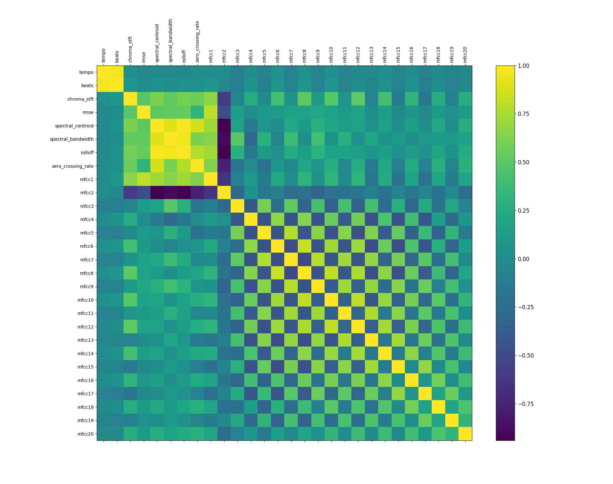
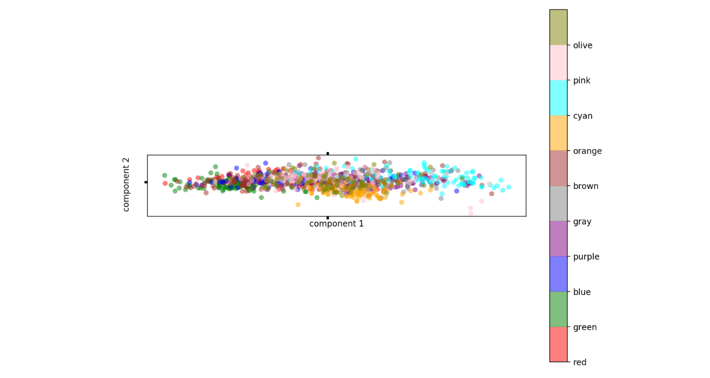
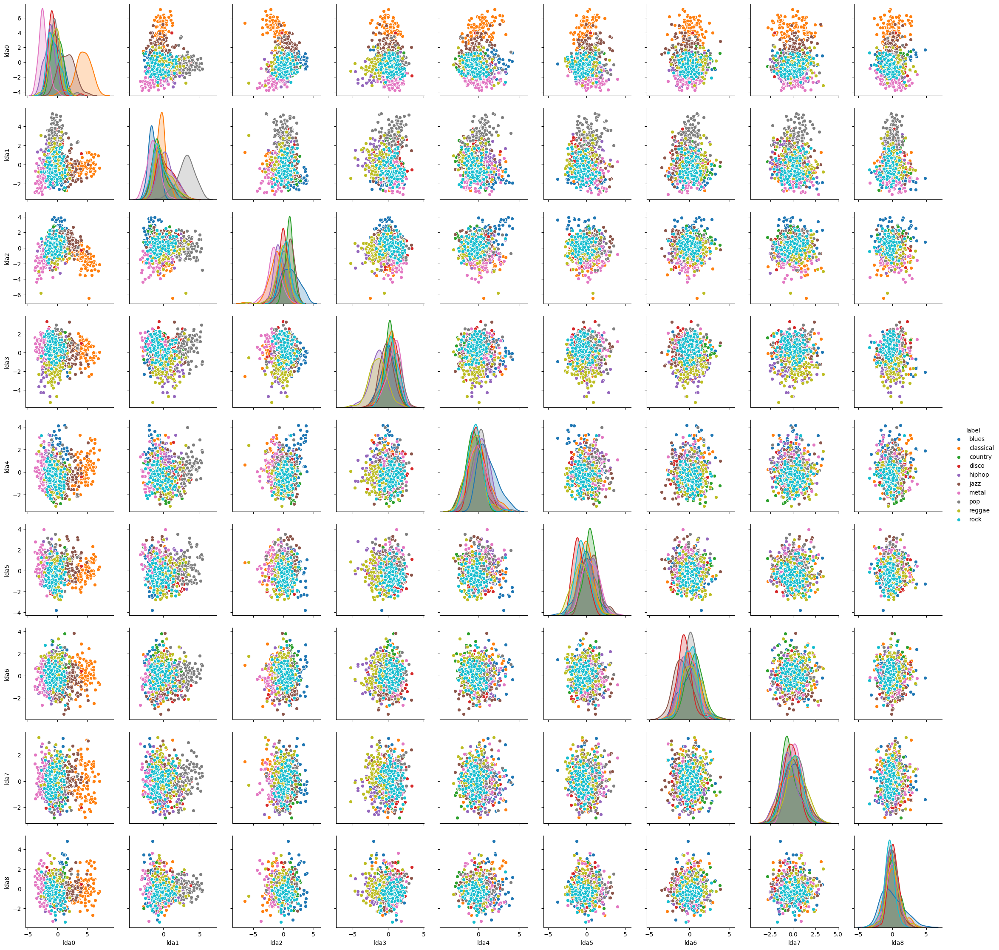

# Music Genre Classification

## Introduction

### What is it exactly?

This project has a simple aim: determine the genre of a song based only on its audio characteristics (no meta-data). These characteristics are for example tempo, 

This problem is a *classification* problem: for each song, we need to attribute a class (a genre). Classification problems are solved using *machine learning* approaches, which have proved to be quite successful in extracting trends and patterns from large datasets. More specifically, our problem is a *supervised* classification problem: the model will learn from labeled data (i.e. each example song has a determined genre).

The possible classes in our problem are: *blues, classical, country, disco, hip-hop, jazz, metal, pop, reggae* & *rock*.

The whole project is and relies on open source code.

### What has been done before

- Study using a similar dataset, but with no real machine learning technique: Tzanetakis, George & Cook, Perry. (2002). *Musical Genre Classification of Audio Signals*. IEEE Transactions on Speech and Audio Processing. 10. 293 - 302. 10.1109/TSA.2002.800560
- Using this very dataset, a study was made on this [github repository](https://github.com/Insiyaa/Music-Tagging), achieving a 63% accuracy.
- Out of the 4 public kernels on Kaggle that used this dataset, the best result had 66% accuracy (https://www.kaggle.com/luiscesar/svm-music-classification). 
  

## Dataset & tools

### The data

The data is available on the *Kaggle* dataset [Music Features](https://www.kaggle.com/insiyeah/musicfeatures), by Insiyah Hajoori. It has been built from 1000 30-second audio tracks of 10 different genres, 100 tracks per genre. Each track is a 22050Hz Mono 16-bit audio file in .wav format, and the features present in the dataset have been extracted from the songs using [libROSA](https://librosa.github.io/librosa/) library.

### The tools

The tools used in this project are Python and *scikit-learn* along with *pandas* and *numpy* for data analysis, and *matplotlib* for data visualization. 

## Methodology

### How we tried to solve this problem

#### Pre-processing

The main processing of the raw (audio) data has been done upstream, as the dataset already contains the features wanted. 

The processing of the songs is made using the [libROSA](https://librosa.github.io/librosa/) open source library, that allows to extract spectral and rhythm features from audio files. This extraction step will be necessary if we want to add other songs to the dataset.

At first, we plot the scatter plot, and it was difficult to analyze because of the many variables we're working with. 

#### 

From the beginning, it seemed that our classes are not easily separable on any of the variables, but this is expected because, since it is a projection in a bi-dimensional plane, the data appear more mixed up than they are in reality, especially for classification problems. 

Because it is a highly-dimensional problem, we also chose to analyse the correlation matrix.

With this plot, we saw that `tempo and beats` were highly correlated, and `chroma_stft, rmse, spectral_centroid, spectral_bandwidth, roloff and zero_crossing_rate and mfcc1`  were too, which explains the scatter plot. From `mfcc2 to mfcc20`, they are not very correlated.

Then, we wanted to understand if our dataset had any outliers, so we plot a distance matrix using Euclidean distances, but we didn't find any particular outliers, so there was nothing to be removed.

Also, there were no missing values, and our problem was balanced, so we were ready to work with it.

To make our dataset more separable, we decided to transform our data into components where classes were supposed to be more apart from each other.

First, we tried PCA, but since the transformation performed by the ACP does not take into account class information, it was not the most effective for class separation, as it is possible to see in the image below.

Then, we tried LDA, which was more effective, because it takes class information into account for the transformation, such that, in the new coordinate space, the separation between classes is maximum. After the LDA transformation, the 20 variables reduced to 9, because the number of transformed variables in the LDA is the number of classes of the original problem (10) minus 1.

With this plot, the separation between classes became more evident.

#### Comparison of models

- List of models: linear/non-linear

  

- Cross-validation

  

#### Adjust of parameters

- Grid search
  

### The mathematical theory behind the models used

## Results

### Visualization and characterization of the data

### Results of the linear models

### Results of the non-linear models

Grid-search for SVM and MLP:

MLP:  0.6086271466227942 -> 0.6524276952805088

### Comparison and discussion of the results

- "The best predicted genres are classical and hiphop while the worst predicted are jazz and rock" - Tzanetakis, George & Cook study (2002)

## Conclusions

### Discussion on the characteristics of the problem

- Few training examples
- Classifications of genres are often arbitrary and controversial
- The prediction is based exclusively on spectral and rhythm characteristics of the songs - is it enough to determine a genre? Jazz songs for instance have many different tonalities and rhythms, where rock songs for example are more consistant bewteen each other. This is certainly one of the reasons why the model has more ease to predict accurately rock songs than jazz ones.

### What's the best model?

### Possible improvements

- subgenres (hierarchical structure)